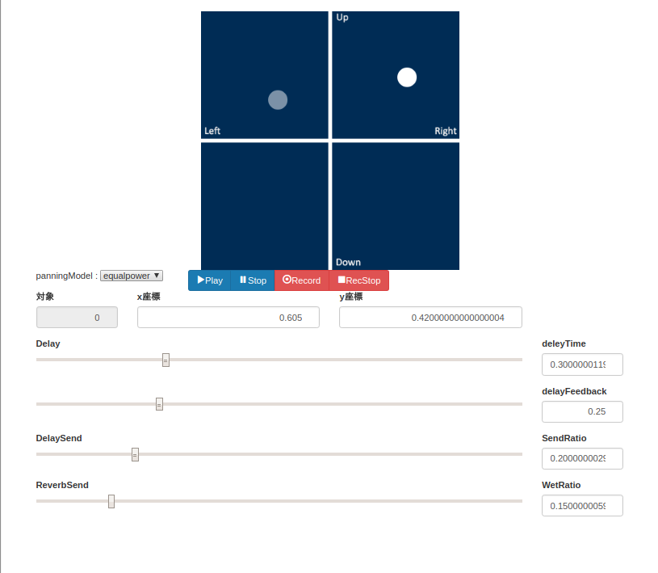
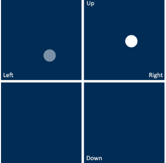
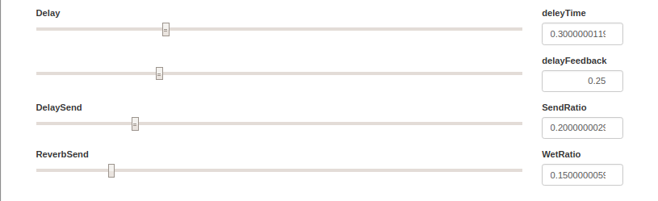

3D mixer on web
====
web上で立体音響を使ったミックス作業を行えるように開発しているソフトウェアです．

## Demo

## Description
WebAudioApiを利用して，ブラウザ上ミックス作業が行える環境を構築しています．
本アプリケーションでは特に，読み込んだオーディオデータに対して空間系エフェクトをかけることができます．  
主な機能としては以下です．  
- 立体音響機能
- ディレイ機能
- リバーブ機能

本アプリケーションでは以下のような回路図によって処理されています．  

## Requirement
HTML5に対応したブラウザで利用可能です．  
バージョン: 62.0.3202.89（Official Build） （64 ビット）で動作を確認しました
#### 依存ライブラリ一覧
- [jquery](https://jquery.com/)
- [bootstrap](https://getbootstrap.com/)
- [createjs](https://createjs.com/)
- [Recorderjs](https://github.com/mattdiamond/Recorderjs)

## Usage
本アプリケーションの全体画面は以下のとおりです．

各部の操作方法の説明します．

#### 立体音響機能
  
読み込まれているトラックがサークルとして表示されています．  
各アイコンをドラッグすることで，立体音響機能を調節できます．  
縦の軸では音の前後を調節し，横の軸では音の左右を調整できます．
また距離にも対応しているので，中心から離れた位置になるほど音量が落ちていきます．

#### ボタン部
  
音の再生などが行えます．  
左のpannerModelパラメータでは，立体音響の減衰パラメータを調整できます．  
右のボタン部では音の再生，終了，音のレコーディング開始，レコーディング停止を選択できます．  
レコーディングでは，現在のストリーミングを録音します．現在流れている音声をそのまま録音します．  
録音を停止するとストリーミング音声をリンクの形でダウンロードすることができます．

#### ディレイ・リバーブ部
  
下方のスライダーでは各トラックごとに独立したリバーブとディレイを定義できます．
各パラメータの詳細は以下の通りです．
- delayTime: ディレイの間隔です．delayTime秒ごとに音声が繰り返されます．
- deleyFeedBack: フィードバックの量です．0~1まで定義されており，この量ごとにディレイの音声が減衰します．例えば0.5の場合では，初回のディレイは50%,次のディレイは25%，さらに次のディレイは12.5%といった具合です．
- DelaySend: ディレイのかかり具合です． 0~1まで定義されており，０にするとディレイ効果はなくなります．１にするとディレイ音声のみになります．
- ReverbSend: リバーブのかかり具合です． 0~1まで定義されており，０にするとリバーブ果はなくなります．１にするとリバーブ音声のみになります．

## Licence
MIT

## Author
[masakiMori](https://github.com/m-masaki72)
